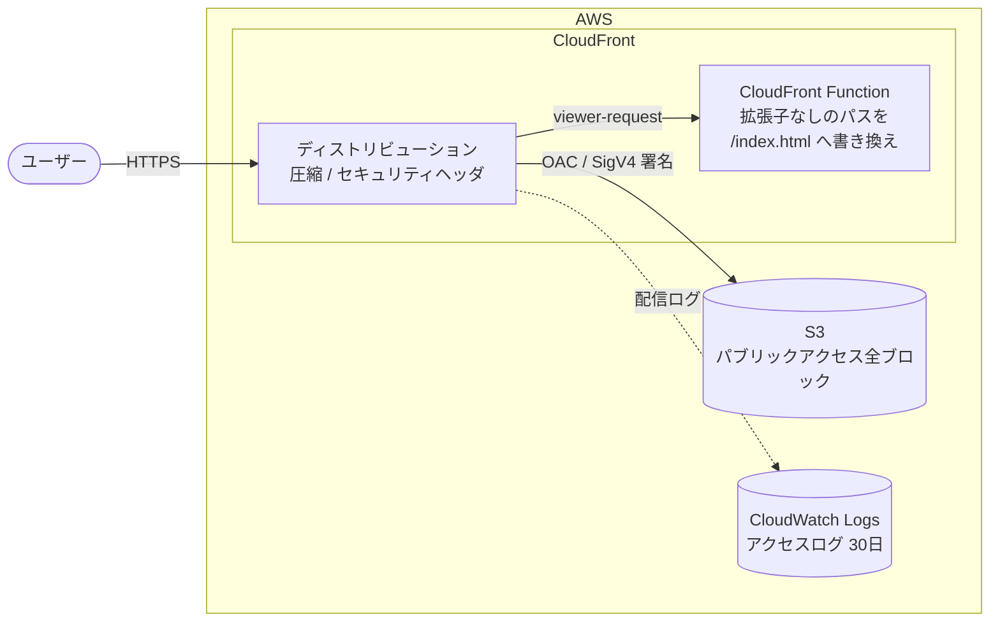
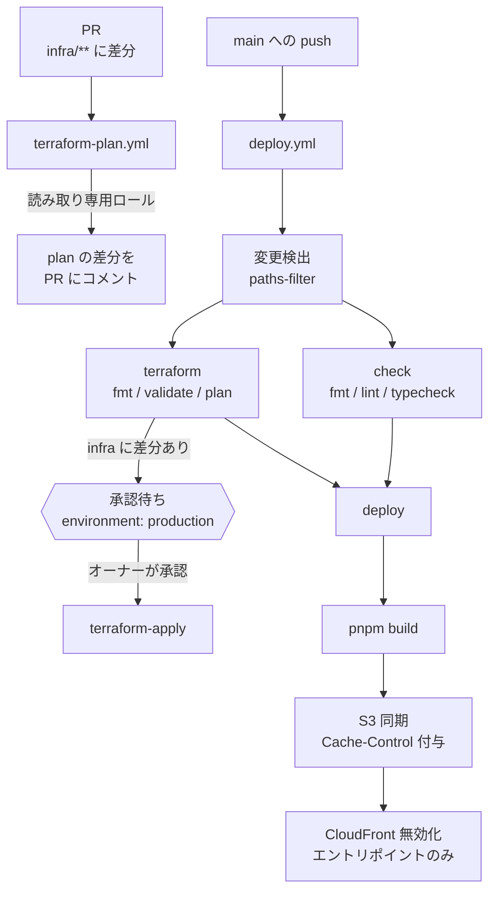
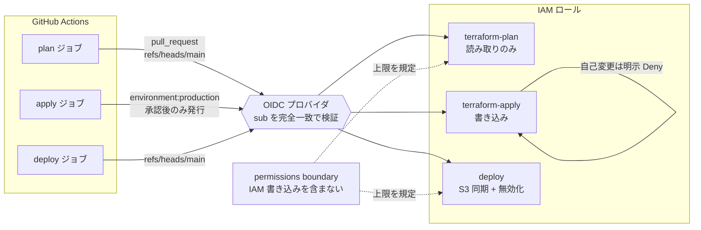

# Study for Terraform of static site deployment

S3 + CloudFront による静的サイトホスティング。インフラは Terraform、デプロイは GitHub Actions（OIDC）で管理している。

## 構成

### 配信経路



S3 はバケットポリシーで、この CloudFront ディストリビューションからの署名付きリクエストのみを許可している。バケットに直接アクセスする経路は存在しない。

### CI/CD



`deploy` は `terraform` の**成功**ではなく**デプロイ先の取得**に依存する。インフラの適用が失敗してもフロントエンドのリリースは止まらない。

### IAM



アクセスキーは保存していない。ロールごとに信頼する `sub` が異なり、実行文脈が変われば Assume できない。

## 必要なもの

- [mise](https://mise.jdx.dev/)（`AWS_PROFILE=learn` などの環境変数を設定する）
- Terraform 1.10 以降（`use_lockfile` による S3 ネイティブロックに必要）
- Node.js 24 / pnpm 10
- `learn` プロファイルの AWS SSO 設定（state バケットへのアクセス権が必要）

## セットアップ

```sh
git clone https://github.com/ryokryok/terraform-aws-static-site-hosting.git
cd terraform-aws-static-site-hosting

pnpm install
mise run aws:login    # aws sso login
mise run aws:check    # 認証確認

cd infra
terraform init        # S3 backend への接続を初期化
```

`terraform init` は必須。state は S3 にあり（接続先は `infra/main.tf` の backend ブロック）、接続情報は gitignore された `.terraform/` に書かれるため、クローン直後は `plan` が実行できない。

## 開発

```sh
pnpm dev              # 開発サーバー
pnpm build            # dist/ にビルド
pnpm lint             # oxlint
pnpm fmt              # oxfmt
```

## インフラ変更

```sh
mise run terraform:check   # fmt -recursive && validate

cd infra
terraform plan
terraform apply
```

state は S3 で共有されており、ローカルと CI が同じものを参照する。`use_lockfile = true` により、CI の apply 中にローカルで実行すると解放まで待たされる。

## デプロイ

`main` への push で `.github/workflows/deploy.yml` が動く。`infra/**` に差分があれば Terraform を、フロントエンドに差分があればビルドと S3 同期・CloudFront 無効化を実行する。

手動実行のトリガーは持たせていない。再デプロイしたい場合は Actions 画面から過去のランを re-run する（`gh run rerun <run-id>` でも可）。差分判定はそのランのコミットに対して再計算されるため、デプロイまで到達したランを選べば同じ内容が再度反映される。

PR に `infra/**` の差分があると `terraform-plan.yml` が動き、plan の結果が PR にコメントされる。読み取り専用ロールで実行するため、この時点で AWS が変更されることはない。fork からの PR では実行しない（未信頼のコードに対して `terraform init` を回さないため）。

### apply の承認ゲート

`infra/**` に差分がある場合、`terraform-apply` ジョブは `production` Environment の承認待ちで停止する。Actions 画面から承認するまで進まない。

これは単なる確認ダイアログではない。apply ロールの信頼ポリシーは `sub = environment:production` を要求しており、**このトークンは承認後にしか発行されない**。承認前の状態では AWS への書き込み権限そのものが存在しない。ブランチ参照による制限より強い。

承認者はリポジトリオーナー。単独運用のため self-review は許可してある（禁止すると誰も承認できず apply が永久に止まる）。

### ロール構成

| ロール                           | 信頼する OIDC の `sub`             | 権限                                |
| -------------------------------- | ---------------------------------- | ----------------------------------- |
| `github-actions-terraform-plan`  | `pull_request` / `refs/heads/main` | 読み取りのみ                        |
| `github-actions-terraform-apply` | `environment:production`           | 書き込み。自身の変更は明示的に Deny |
| `github-actions-deploy`          | `refs/heads/main`                  | S3 同期と CloudFront 無効化         |

ARN はリポジトリ変数 `TF_PLAN_ROLE_ARN` / `TF_APPLY_ROLE_ARN` / `DEPLOY_ROLE_ARN` で設定する。

### 権限昇格の遮断

apply ロールは `github-actions-*` のロールを操作できるため、放置すると自分の権限を広げられてしまう。2段構えで塞いである。

**1. 自己変更の明示 Deny** — apply ロール自身への `UpdateAssumeRolePolicy` や `PutRolePolicy` を拒否する。信頼ポリシーを書き換えて任意の `sub` から Assume できるようにする経路を断つため。

**2. permissions boundary** — `github-actions-boundary` ポリシーが、apply ロールの管理するロールが持てる権限の上限を定める。実効権限は「ロールのポリシー ∩ boundary」になる。

boundary には **IAM の書き込みを含めていない**。apply ロールが乗っ取られても、新たな管理者ロールを作って迂回することができない。ロールの新規作成は boundary が付くことを条件にしてのみ許可し、boundary の取り外しも Deny してある。

apply ロール自身には boundary を付けない（IAM 操作が必要なため）。上記1で保護している。

この設計の帰結として、**apply ロール自体と boundary ポリシーの変更は CI からは行えない**。変更する場合はローカルの管理者権限で `terraform apply` する。

## 現時点で入れていないもの

学習用リポジトリとして意図的に見送っている、あるいはプランの制約で入れられない項目。

| 項目                             | 理由                                                       |
| -------------------------------- | ---------------------------------------------------------- |
| 独自ドメイン + ACM 証明書        | ドメイン未取得。`us_east_1` プロバイダエイリアスは用意済み |
| CloudWatch アラームと通知        | 通知先が必要。現状は 5xx の増加に気づく手段がない          |
| WAF                              | 静的サイトでは費用に見合いにくい                           |
| state バケットの別アカウント分離 | 単一アカウント運用のため                                   |

## 補足

```sh
mise run aws:open     # 公開中のサイトを開く
```
